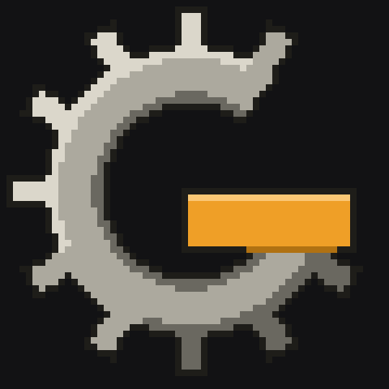

<p align="center">
  
</p>

<h1 align="center">Gearbox</h1>

<p align="center">
  A scaffold for multi-agent collaboration projects —<br>
  <code>AGENTS.md</code> as the single source of truth + ADRs + a CI hard gate.
</p>

<p align="center">
  <a href="https://www.npmjs.com/package/gearbox-agents"></a>
  <a href="LICENSE"></a>
</p>

> Formerly named `agents-md-scaffold`, renamed **Gearbox** on 2026-07-19 (ADR-0015). The old GitHub URL redirects automatically.

## Quick start (zero config, ADR-0028)

Just need node — no clone, no PATH setup:

```bash
# Lay down the Gearbox scaffold in a new project directory (placeholders, gate,
# ADR provenance + hash stamps all automatic)
npx gearbox-agents install --maintainer <your-github-username> --gate "npx tsc --noEmit"
# All three args are optional: omit and a <placeholder> is left in place;
# ci.yml ships a deliberately-failing placeholder command. On an interactive
# terminal, omitting --maintainer triggers a one-question binding prompt
# (gh-detected default, Enter accepts, "-" skips, ADR-0036)

# Later, check sync / backfill upstream protocol updates anytime (pull-triggered, ADR-0026)
npx gearbox-agents version    # check which upstream version / which ADRs this repo is synced to
npx gearbox-agents update     # copy missing upstream ADRs into this repo, producing a review-ready branch
```

> npx path: the package ships its own upstream snapshot; `version`/`update` diff against that packaged snapshot (ADR-0028).
> All commands are node, cross-platform (`version` was bash until ADR-0035 rewrote it in node).

## 🤖 For AI agents (installing on a user's behalf)

If a user pointed you at this repo and asked you to "install Gearbox" into their project, do this:

1. **Check the target first**: if the project root already has a Gearbox-made `AGENTS.md` (it has a `## Working agreement (multi-agent)` section), do **not** install — the project is already onboarded; run `npx gearbox-agents update` instead to backfill protocol updates. A hand-written `AGENTS.md` is the user's own asset: the install preserves it as `AGENTS-backup.md` and proceeds (ADR-0038/0039), but **ask the user before running install over their file** — after install, merge their rules from the backup into the generated Hard rules / Tech stack sections, then delete the backup and the ⚠️ merge notice the install put at the top of the new `AGENTS.md` (the install isn't complete until that notice is gone).
2. **Run the install** from the project root:

   ```bash
   npx gearbox-agents install --maintainer <the-users-github-username> --gate "<the-projects-check-command>"
   ```

   - `--maintainer` = the user's **GitHub username** (asynchronous L1 approval is verified against that account, ADR-0034). Ask the user if you don't know it.
   - `--gate` = a command that automatically asserts "nothing's broken" (e.g. `npx tsc --noEmit && npx vitest run`). Derive it from the project's tooling, or ask.
   - Both flags are optional — omitting them leaves `<placeholder>`s to fill in later (the generated `ci.yml` then ships a deliberately-failing placeholder so CI can't be green before the gate is real).
3. **After install**: fill in the remaining placeholders (`grep -n '<' AGENTS.md` lists them: project intro, Hard rules, Tech stack), then make the first commit.
4. **Read the generated `AGENTS.md` top to bottom** — it is your working agreement in that repo from now on (shift steps, issue/PR roles, protocol-change tiers, gate discipline).

**Maintainers / contributors** (working on Gearbox itself) use a local clone:

```bash
node ~/Github/gearbox/scripts/gearbox-install <repo> --maintainer <your-github-username> --gate "npx tsc --noEmit"
```

After installing:
1. Fill in the remaining `<placeholder>`s in `AGENTS.md` (`grep -n '<' AGENTS.md`)
2. Write your first project-specific architectural decision into `docs/adr/` (project ADRs get their own numbering, starting at 0001); protocol ADRs live in `docs/gearbox-adr/` (tool-managed; format shown in its `0001-adr-template.md`)
3. Step 4 of the three start-of-shift steps runs `npx gearbox-agents version` to self-check the protocol version (pull-triggered)

## Architecture (why it's shaped this way)

| File | Role |
|---|---|
| `AGENTS.md` | Single source of truth. Every agent (Claude Code, Z Code, etc.) reads it. Rules live here and only here |
| `CLAUDE.md` | Empty shell, a single `@AGENTS.md` line. Compatible with older Claude Code + a future mount point for Claude-specific content |
| `CONTEXT.md` | Domain glossary. Keeps different agents from understanding the same business term differently |
| `docs/gearbox-adr/` | Protocol ADRs (copied from Gearbox, tool-managed). `docs/adr/` holds this project's own decisions |
| `.github/workflows/ci.yml` | Hard gate. Red means no merge — the one constraint that doesn't depend on agent self-discipline |

Deliberately **no** `HANDOFF.md`: progress and handoffs run through GitHub Issues + PRs (append-only, timestamped, never goes stale).

## Validated in practice (the date-cli experiment + Gearbox eating its own dogfood)

This protocol isn't just theory — it ran **4 rounds of multi-agent collaboration validation** in [`real-stanyan/date-cli`](https://github.com/real-stanyan/date-cli) (private) (Z Code kicked it off + Claude Code carried it through 3 more rounds, full git log / issues / PR / ADR trail available), then ran rounds 5 and 6 on **this repo itself** using the same protocol (dogfooding: using the protocol to maintain the protocol). Every mechanism that emerged landed as an ADR:

| Mechanism | ADR | Problem it solves | Origin |
|---|---|---|---|
| Memory five-field format | 0004 | Scheduling decisions (why a, not b) no longer rot, without polluting the ADRs | date-cli |
| Handoff Memory lives in an open issue | 0005 | The next shift naturally finds the entry point when starting work, no longer needs a human to point the way | date-cli |
| Tiered authorization for protocol changes (L1/L2) | 0006 | Hard rules/Gate can't be changed autonomously by an agent; Working agreement can | date-cli |
| PR disposition details | 0007 | Merge strategy / merge authority / mutual review or not no longer rely on ad hoc authorization | date-cli practice, retroactively confirmed |
| Explicit division-of-labor placeholder | 0008 | Division of labor is a project property; the fallback with no agreement = Task issue claim-based ownership | Round 5 |
| Terminal-shift exemption | 0009 | Distinguishes "ended shift in violation" from "work is genuinely done"; a silent ending doesn't count as terminal | Round 5 |
| Gate assertion tiering | 0010 | Tightening a gate assertion is frictionless L2; loosening/removing one needs human agreement | Round 5 |
| Subagent template and routing | 0011 | The main agent lacked a unified template for dispatching work; downstream can backfill it as needed | Round 6 |
| L1/L2 boundary criterion (mechanism-reference-first) | 0012 | Agents used "optional + pure addition" as an L2 channel to expand the protocol's boundary (retrospective on PR #21) | Round 6 |
| Downstream backfill reminder (B-3) | 0013 | Gearbox is a template, not a dependency; downstream repos had no visibility into missed protocol improvements | Round 6 |

**What the experiment did and didn't validate:**

- ✅ **Held up:** zero-verbal handoffs, the protocol self-repair loop (find a gap → fold it into AGENTS.md), three shifts of code collaboration with nothing left to guesswork
- ✅ **New in round 5:** the protocol catching its own violations — the previous shift didn't open a handoff issue, the next shift hit an empty starting point per "On starting a shift," opened a protocol-gap issue, and ADR-0009's boundary clause grew out of that, all without anyone pointing the way; the L1 weak-b form (maintainer says "agree" in-session + leaves a trace in a PR comment) ran end-to-end for the first time
- ✅ **New in round 6:** the protocol catching an overreach (PR #21 had an agent use an L2 self-merge to introduce a template that referenced L1/L2, and the retrospective grew ADR-0012's criterion to block that path) + the backfill mechanism closing its own loop (0013 introduced B-3, and the PR that introduced it opened its own downstream issue per B-3 — a complete evidence chain)
- 🔸 **Partially held up:** the gate as a backstop — it genuinely catches issues in pure-function areas, but the I/O layer and test-file types remain a persistent blind spot (whack-a-mole)
- ❌ **Not solved:** an all-green gate ≠ "correct" — this is inherent to regression-style guarantees and no protocol can fix it on its own

**Honest boundaries — all of the following are unvalidated; you own the risk if you carry this elsewhere:**

- **Scale:** n=1 user, 2 agents, a toy-sized codebase. Never tested against a real project's code volume or business complexity
- **Concurrency:** the whole protocol assumes a shift model (one agent at a time). Multiple agents present simultaneously would break the premise underlying ADR-0007 (which itself documents the conditions that would overturn it)
- **Division of labor:** ADR-0008 admits n=0 — the placeholder is the answer
- **L1 while offline:** so far the weak-b form has always been the maintainer responding in real time; when the maintainer is offline, an L1 change just sits there. This bottleneck is explicitly accepted but has never actually been felt
- **Ceremony cost:** every shift's issue + five-field Memory + mandatory ADR for protocol changes — in the protocol experiment this was data; in a high-frequency, small-task setting it's a tax

If some agent doesn't recognize `AGENTS.md`, symlink it in the repo: `ln -s AGENTS.md <the filename that tool expects>`.

Design discussion originated in the mandys_bubble_tea project, 2026-07-17 session (a reflection on multi-agent collaboration architecture).
